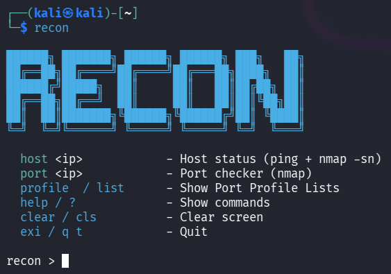
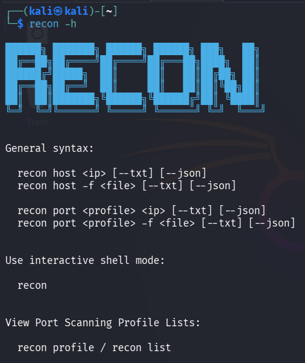
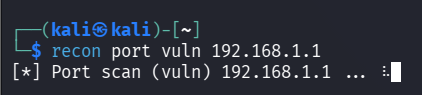
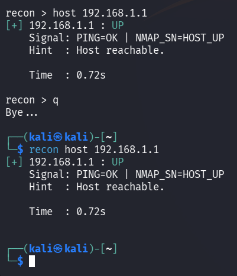
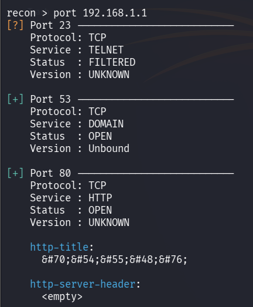
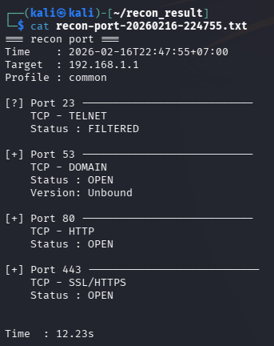
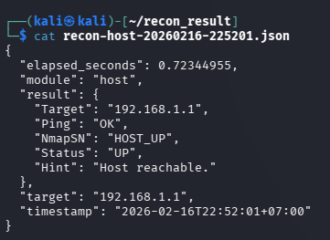

# Recon
**Profile-based Nmap reconnaissance with clean, structured TXT + JSON output.**

Recon is a lightweight CLI tool that runs **profile-based Nmap recon** and produces **clean, structured output** (TXT + JSON).  
It supports both **interactive shell mode** and **CLI shortcut mode**, with flexible multi-target scanning and custom port support.

> ⚠️ Use responsibly. Only scan systems you own or have explicit permission to test.

---

## 🚀 Latest Update – 27 Feb 2026
- Removed IP/Host limit restriction
- Added custom port support for port scanning

➡️ [View all updates](CHANGELOG.md)

---

## 📚 Port Scanning Profiles

For a complete and detailed list of available port profiles and their Nmap mappings:

➡️ **[View Port Scanning Profile Lists](src/profile_lists.md)**

---

## Interactive Mode

<p align="center">
  
</p>

---

## CLI Help

<p align="center">
  
</p>

---

## Features

- **Two modes**
  - Interactive shell: run commands inside `recon >`
  - CLI shortcut: run directly from terminal

- **Port profiles**
  - Default / common / deep + service-specific profiles

- **Custom port scanning**
  - Define specific ports manually for targeted scans

- **Flexible multi-target scanning**
  - Scan multiple targets via `-f <file>` (one IP per line)
  - No built-in IP/Host scanning limit

- **Structured output**
  - `--txt` pretty human-readable format
  - `--json` machine-readable results
  - Auto-saves to `~/recon_result/` with timestamped filenames

- **Service reference (`info <service>`)**
  - Built-in enumeration checklist & tool examples
  - Example: `info smb`, `info ssh`

- **Progress & warnings**
  - Context-aware warnings (e.g., deep profile in file mode)

---

## Requirements

- Go (for install/build)
- `nmap` installed and accessible in PATH
- Standard utilities like `ping` (for host check)

> Some scan types (e.g., OS detection `-O`, traceroute) may require elevated privileges depending on your OS/environment.

---

## Installation

### Using `go install`

```bash
go install github.com/nartodono/recon/cmd/recon@latest
```
If module resolution issues occur:
```bash
GOPROXY=direct GOSUMDB=off go install github.com/nartodono/recon/cmd/recon@main
```

### Using `git clone`
```bash
git clone https://github.com/nartodono/recon.git
cd recon
go build ./cmd/recon
```

## Tools Usage

INTERACTIVE MODE
----------------
Start Recon without arguments:
```bash
  recon
```
Inside the shell:
```bash
  recon > host 192.168.1.1 --txt --json
  recon > port 192.168.1.1 -p 3306
  recon > port vuln 192.168.1.1 --txt
  recon > port ssh-deep -f list.txt
  recon > info smb
  recon > profile
  recon > exit
```

CLI SHORTCUT MODE
-----------------
Run directly from terminal:
```bash
  recon host 192.168.1.1 --txt --json
  recon port 192.168.1.1 -p 3306
  recon port web-deep 192.168.1.20 --txt --json
  recon port ssh-deep -f list.txt
  recon info smb
  recon list
```
If no profile is specified:
```bash
  recon port 192.168.1.1
```
The 'default' profile will be used automatically.


FILE MODE
---------
Scan multiple targets from file (one IP per line):
```bash
  recon host -f targets.txt --txt --json
  recon port -f targets.txt --txt
  recon port deep -f targets.txt --txt --json
```

### Custom Port Usage

By default, each service profile uses its standard port.
You can override it using `-p <port>`.

Example:

```bash
recon port ftp 192.168.1.10 -p 9109
```

---

## 🧭 Service Reference (`info <service>`)

Recon provides quick service cheat-sheets to guide what to check, common misconfigurations, and example enumeration commands.

Examples:
```bash
recon info smb
recon info ssh
```

---

OUTPUT OPTIONS
--------------
  `--txt`   Print formatted text output
  `--json`  Print structured JSON output

Both flags can be used together.


NOTES
-----
- Results are automatically saved to:
    ~/recon_result/

- Output filenames follow:
    `recon-host-YYYYMMDD-HHMMSS.txt`
    `recon-host-YYYYMMDD-HHMMSS.json`
    `recon-port-YYYYMMDD-HHMMSS.txt`
    `recon-port-YYYYMMDD-HHMMSS.json`

- Recon checks required dependencies on startup:
    nmap
    ping

## Example

### Vulnerability Scan
<p align="center">  </p>

### Host Scan
<p align="center">  </p>

### Port Scan
<p align="center">  </p>

### Saved TXT Output
<p align="center">  </p>

### Saved JSON Output
<p align="center">  </p>
